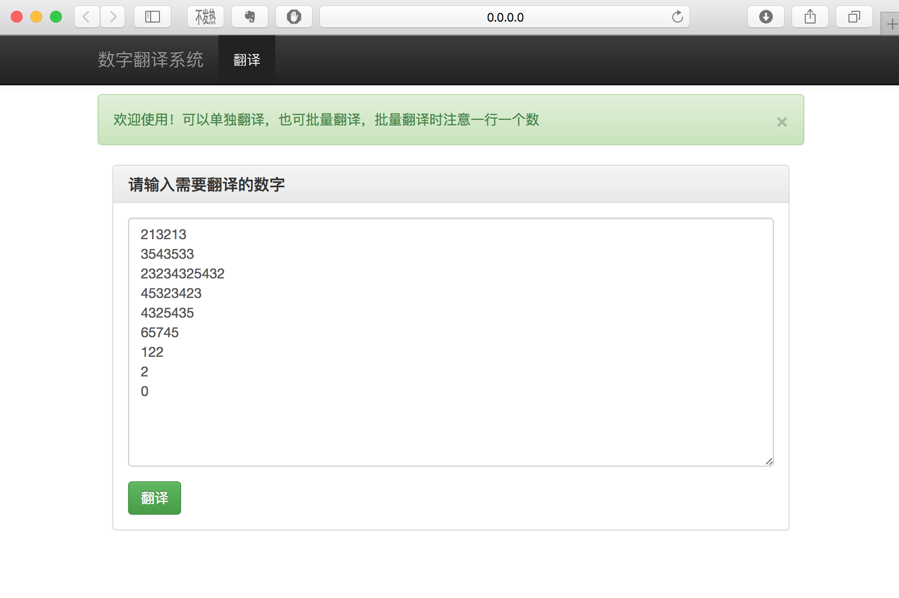
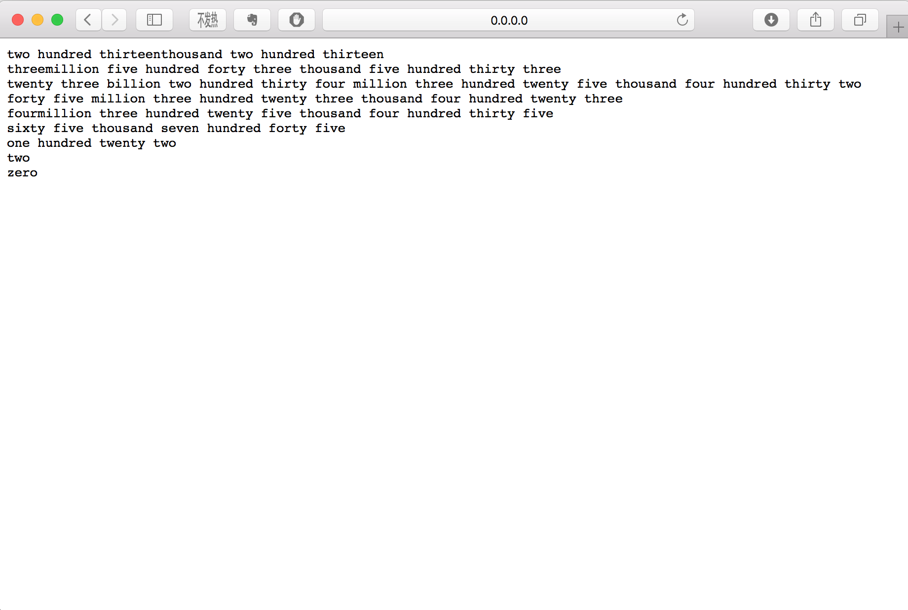

## Number Translate implement by Python
This is a small demo of number translate program. It is implement by Python. I use web.py to make this demo as a web app.

It is like this:





## Requirement
* Python 2.7
* web.py

## Run it By

```sh
git clone https://github.com/AbangLZU/NumberTranslate.git
cd NumberTranslate
python app.py
```

then it will show something like:
```sh
Environment: development
http://0.0.0.0:8080/
```

visit the http://0.0.0.0:8080/ on your browser then you can use this 
program
